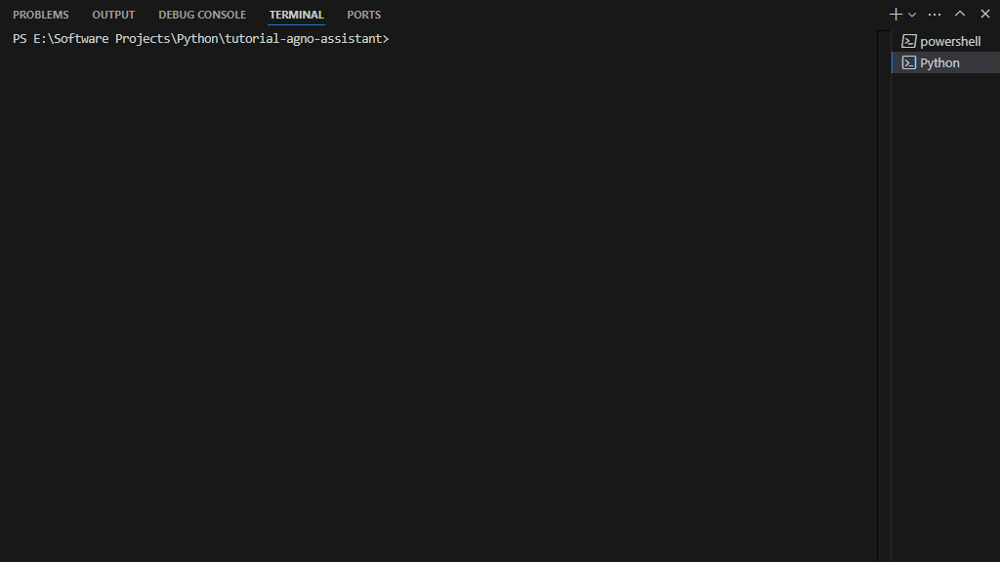
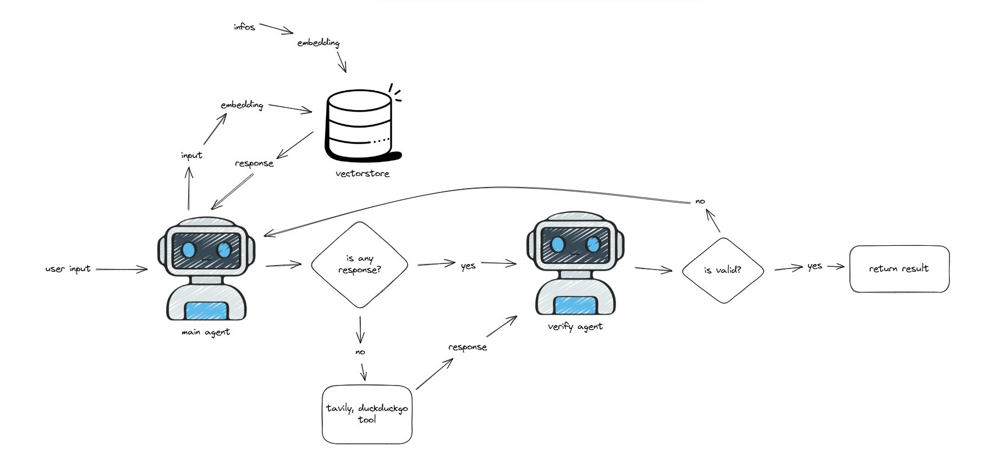
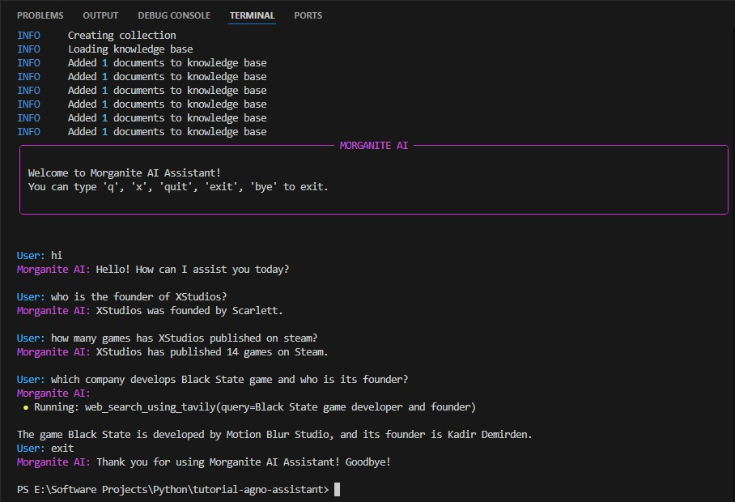

# tutorial-agno-assistant

<div align="center" id="top">
    <picture>
      <source media="(prefers-color-scheme: dark)" srcset="https://agno-public.s3.us-east-1.amazonaws.com/assets/logo-dark.svg">
      <source media="(prefers-color-scheme: light)" srcset="https://agno-public.s3.us-east-1.amazonaws.com/assets/logo-light.svg">
      
    </picture>
</div>

## Overview
Agno agentic ai application that performs vectorstore query or web search based on user inputs. AI agent checks for hallucinations before sending the final response to the user.

<div align="center" id="gif2">
    
</div>

## Diagram
<div align="center" id="gif3">
    
</div>

## Key Features
- **Agno Agentic AI**
- **OpenAI API Integration**
- **Dual Info Source**
  - Vectorstore: LanceDB
  - Web search: Tavily, DuckDuckGo
- **Response Verification**
  - Agno Structured Outputs
- **Hallucination Checker**
  - LLM checks the response before sending the final response
- **User-Friendly Interface**
  - Rich console interface with colored output
  - Markdown support for formatted responses
## Technical Stacks
- Python
- Agno
- OpenAI API
- LanceDB
- Tavily
- DuckDuckGo

## Getting Started
**Clone the repository:**
```bash
https://github.com/XF17K/tutorial-agno-assistant.git
cd tutorial-agno-assistant
```
**Create virtual environment:**
```bash
python -m venv .venv
```
**Activate the virtual environment:**
```bash
.venv\Scripts\activate
```
or
```bash
.venv\Scripts\activate.bat
```
**Install requirements:**
```bash
pip install -r .\requirements.txt
```
**Set up the .env file with your own API keys:**

Tavily API is optional, you can use DuckDuckGo as free (main2.py).
```env
OPENAI_API_KEY=12345678
TAVILY_API_KEY=12345678
```
**Run the application:**

For use with Tavily:
```bash
python main.py
```

For use with DuckDuckGo:
```bash
python main2.py
```

## Configuration
You can configure the app from config.py file.
- AI Assistant Name
- User Name
- Exit Commands
- LLM Max Attempts
- Infos for vectorstore
- AI Assistant start and end message

## Note
- You can use another vectorstore: [Vectorstore](https://docs.agno.com/vectordb/introduction)
- You can use another Knowledge Base instead Document Knowledge Base : [Knowledge Base](https://docs.agno.com/knowledge/introduction)
- Used OpenAIEmbedder on this project. You can use another embedders: [Embedder](https://docs.agno.com/embedder/introduction)
- For more complex applications, I recommend using workflow: [Workflow](https://docs.agno.com/workflows/introduction)
- Agent's prompts are not perfect. You can edit and customize it. Sometimes it can give incorrect answers with some llm models.
- When 'add_history_to_messages' is True, be careful, careless use may result in the use of too many tokens.

```python
# ...
agent = Agent(
    model = OpenAIChat(id = "gpt-4o-mini"),
    knowledge = knowledgeBase,
    tools = [TavilyTools()],
    add_references = True,
    search_knowledge = True,
    show_tool_calls = True,
    add_history_to_messages = True, # be careful when using this
# ...
```

## Console View
<div align="center" id="gif">
    
</div>

## License
This project is licensed under the MIT License - see the [LICENSE](LICENSE) file for details.


